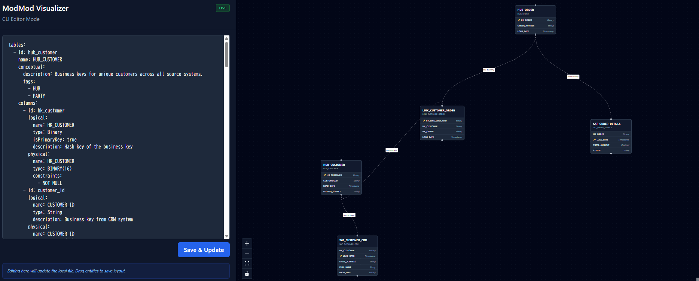

#  ModMod (Modeling-Modeler)

ModMod is a YAML-driven data modeling visualizer. It helps data engineers and architects bridge the gap between conceptual, logical, and physical data models while maintaining sample data "stories".

 

[sample page](https://yujikawa.github.io/modmod/)

## Features

- **YAML-First**: Define your entire data model in a single, simple YAML file.
- **Unified Sidebar**: A feature-rich sidebar accessible in both `dev` and `build` modes.
  - **Tabs**: Switch between **Editor** (YAML) and **Entities** (Navigation).
  - **Collapsible**: Collapse the sidebar to maximize your ER diagram viewing area.
- **Interactive ER Diagram**: Drag-and-drop entities to create the perfect layout.
- **Diagram Navigation**: Click entities in the sidebar to smoothly focus and zoom in on them.
- **Sandbox Mode**: Temporary in-memory editing in static builds. Try "What-if" modeling without affecting the source.
- **Layout Persistence**: Diagram positions (including **Domains**) are automatically saved to your YAML file in dev mode.
- **CLI-Driven Workflow**:
  - `modmod dev`: Interactive editor with live updates.
  - `modmod build`: Package your model into a standalone static site.

## Installation

### Prerequisites
- Node.js (v18 or higher)

### Global Installation (via GitHub)
You can install ModMod directly from GitHub to use the `modmod` command anywhere:

```bash
npm install -g https://github.com/yujikawa/modmod
```

### Local Setup (for Development)
```bash
# Clone the repository
git clone https://github.com/yujikawa/modmod.git
cd modmod

# Install dependencies for both CLI and Visualizer
npm install
cd visualizer && npm install
cd ..

# Link the command to your system
npm link
```

## Usage

### 0. Initialization (AI Agent Setup)
Scaffold project-specific modeling rules and configure your favorite AI agents (Gemini, Codex, Claude) to follow them.

```bash
modmod init
```
- Creates `.modmod/rules.md` as your project's "Source of Truth" for modeling.
- Generates agent-specific configurations (skills, prompts, commands) that point to these rules.
- **Why?**: This ensures AI agents generate YAML that perfectly matches your organization's standards.

### 1. Development Mode (Interactive Editor)
Start a local session to edit your YAML and arrange entities.

```bash
# Point to a directory to manage all models within it
modmod dev samples/

# Or point to a specific file
modmod dev my-model.yaml
```
- Opens `http://localhost:5173` automatically.
- **Multi-file Support**: Switch between models using the dropdown in the sidebar.
- **Secure Routing**: Models are accessed via slugs (e.g., `?model=ecommerce`), keeping your local paths private.
- **Editor Tab**: Edit YAML with live updates to the diagram.
- **Entities Tab**: Search and quickly navigate to specific tables or domains.
- **Persistence**: Drag entities to save positions directly to the source YAML file.

### 2. Static Site Build
Generate a standalone documentation site from your YAML model.

```bash
modmod build my-model.yaml -o ./docs-site
```
- Generates a `docs-site/` folder with a single-file visualizer.
- Includes the **Sandbox Mode**, allowing viewers to temporarily edit the model in their browser.
- Perfect for hosting on **GitHub Pages**, S3, or internal documentation portals.

## YAML Schema Example

```yaml
tables:
  - id: hub_customer
    name: HUB_CUSTOMER
    appearance: # Optional: Visual style (icon and color)
      type: "hub" # Predefined: hub, link, satellite, fact, dimension
      icon: "🌐"  # Optional: Emoji override
      color: "#fbbf24" # Optional: Hex color override
    conceptual:
      description: "Business keys for unique customers."
      tags: ["HUB", "PARTY"]
    columns:
      - id: hk_customer
        logical: { name: "HK_CUSTOMER", type: "Binary", isPrimaryKey: true }
        physical: { name: "HK_CUST", type: "BINARY(16)", constraints: ["NOT NULL"] }

domains:
  - id: customer_domain
    name: Customer Domain
    tables: ["hub_customer"]
    color: "rgba(59, 130, 246, 0.05)"

relationships:
  - from: { table: hub_customer, column: hk_customer }
    to: { table: sat_customer_crm, column: hk_customer }
    type: "one-to-many"

layout: # Automatically managed by the visualizer or AI Agent
  hub_customer: { x: 100, y: 100 }
  customer_domain: { x: 50, y: 50, width: 600, height: 400 }
```

### Key Attributes
- **appearance**: Controls the node's visual identity. `type` sets a default icon and color (e.g., `hub` is Amber 🌐, `fact` is Red 📊). Use `icon` or `color` to override.
- **layout**: Stores (x, y) coordinates and dimensions. While the visualizer manages this automatically during drag-and-drop, AI Agents use this to arrange new entities logically.


## License
MIT
